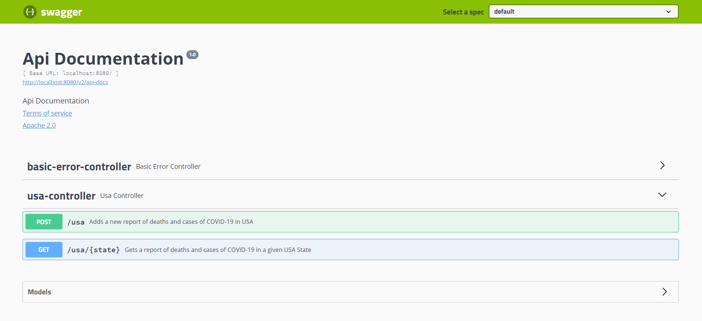
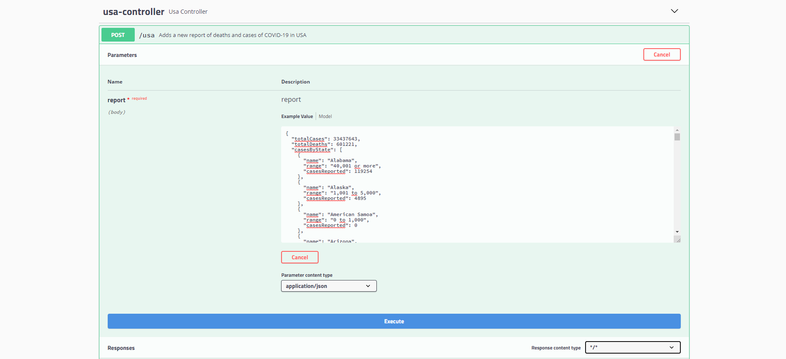

# Covid API

Covid API es una API que permite obtener diferentes tipos de datos acerca de
la situación de Covid actual comunicandose con otras API's ya existentes para obtener los datos.
Se utiliza una base de datos en memoria H2 para almacenamiento de datos y testing.

# Estructura general del proyecto

El proyecto esta estructurado en capas respetando el patrón Controller - Service - Repository:
* **Controllers:** Definen un punto de entrada para los inputs y determinan qué acciones se tomarán sobre los datos de entrada. Por ejemplo, determinan que el endpoint `\usa\Virginia` retornará una lista de datos correspondientes a los casos de Covid ocurridos en Virginia.
* **Servicios:** Proveen la lógica de negocio, en este caso acceden a los diferentes repositories para obtener los datos requeridos.
* **Repositories:** Permiten la abstracción del acceso a la base de datos que almacena la información.

Las estructuras almacenadas en base de datos o objetos DE (Data Entity) estan diferenciados de los objetos de transferencia de negocio o TO (Transfer objects). Los mappers realizan la conversion entre unos y otros. 

## Swagger

Para documentar la API se utiliza Swagger. Al levantar la aplicación y acceder a `http://localhost:8080/swagger-ui.html#/` podremos ver la documentación de la API con una interfaz agradable y también probarla haciendo requests y recibiendo responses.

En este momento las requests permitidas son:

* **POST** `http://localhost:8080/usa` para agregar un reporte de COVID-19. El formato de JSON que recibe en este request recibe en el body puede obtenerese [aqui](https://api.apify.com/v2/key-value-stores/moxA3Q0aZh5LosewB/records/LATEST?disableRedirect=true). 
* **GET** `http://localhost:8080/usa/{state}` para obtener una lista con los reportes de COVID-19 correspondientes a un dado Estado de Estados Unidos.  

## In-memory DB
Se cargaron datos correspondientes al reporte de casos en USA del dia 25-06-2021 en la in memory DB H2. Además en `resources` se puede encontrar un JSON con los datos del día 27-06-2021 que puede incorporarse al proyecto mediante un POST con el JSON en el body.

[img3](images/h2.png)

## 42 Crunch
EN PROGRESO
El contrato que define la api se encuentra en un archivo .yaml validado en 42 crunch.

## Testing
EN PROGRESO
Se han realizado pruebas unitarias con JUnit.

## Requerimientos

- IntelliJ IDEA 2021.1.2
- JDK 16.0.1
- SpringBoot version 2.4.3
- Gradle 6.1
